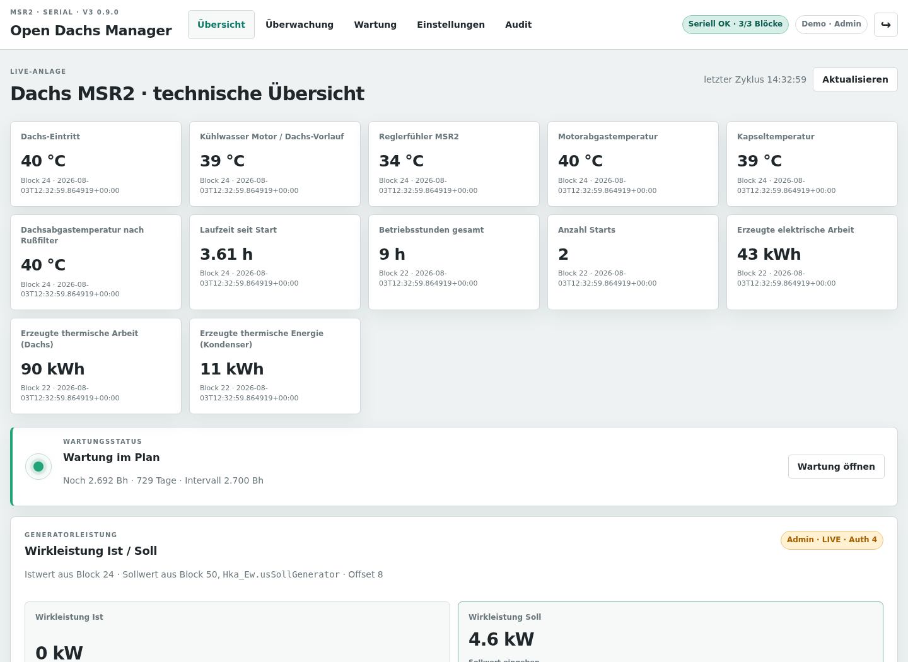
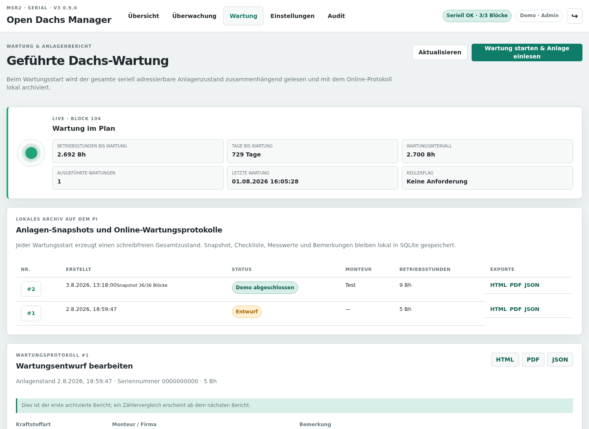
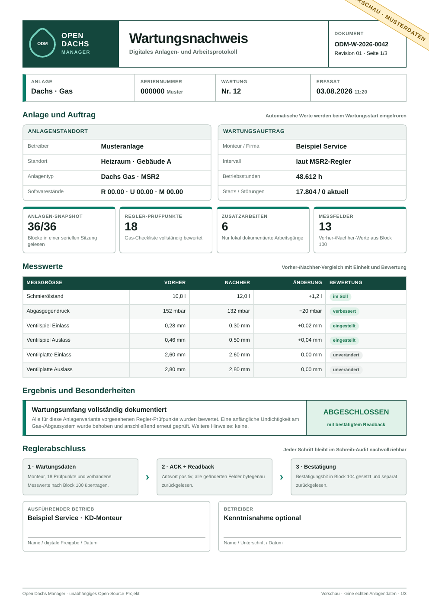
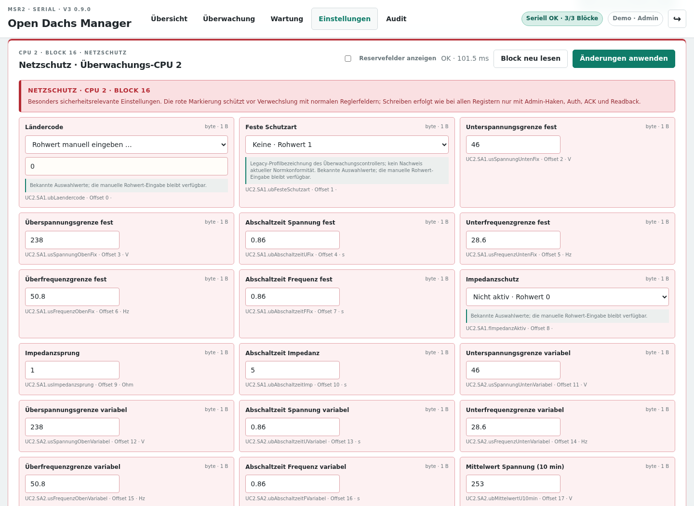
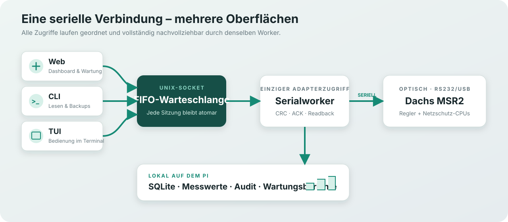

# Open Dachs Manager · V3 1.5.0

Lokale Bedienung, Überwachung und Wartungsdokumentation für Dachs-Anlagen mit
MSR2-Regler – über die optische serielle Schnittstelle und ohne Cloud-Zwang.

> **Projektstatus: Version 1.5.0.** Lesen, Dekodieren, Wartungs-Testmodus und der
> zentrale Serialworker sind an einer Anlage praktisch erprobt. Ein echter
> Schreibvorgang erfordert immer die ausdrückliche Schreibfreigabe,
> Authentifizierung, eine positive Antwort und die anschließende Rückleseprüfung.

Open Dachs Manager ist ein unabhängiges Open-Source-Community-Projekt.



## Was ist enthalten?

| Bereich | Funktionen |
|---|---|
| **Übersicht** | Wirkleistung Ist/Soll, Wartungsrestzeit, frei auswählbare Live-Kacheln und technisches Anlagenbild mit Rußfilterschätzung |
| **Überwachung** | Live-Werte, Anlagenbild, Historien, Service- und Warnmeldungen |
| **Wartung** | Vollständiges 38-Ziele-Pflichtbackup, schreibfreier Gesamtsnapshot, digitale Checkliste, Vorher-/Nachher-Werte und PDF/HTML/JSON |
| **Backup** | Geschütztes Wartungsarchiv, alle 36 Reglerblöcke und Block 16 beider Netzschutz-CPUs sichern, Abbilder prüfen und ausgewählte Ziele im Dry-Run oder kontrolliert wiederherstellen |
| **Einstellungen** | Vollständig dekodierte Register, kontrollierte Schreibvorgänge sowie je Netzschutz-CPU Legacy-Schutz, zusätzliche Schutzparameter und Live-Netzwerte |
| **System** | Mehrere Benutzer, Rollen, Passwortverwaltung, API-Freigabe und Token-Manager |
| **Werkzeuge** | Weboberfläche, CLI, TUI, JSON-Backups, Audit-Protokoll und systemd-Dienste |

Weitere Merkmale:

- lokaler Betrieb auf Raspberry Pi oder einem vergleichbaren Linux-System
- beliebig viele lokale Gast- und Admin-Konten mit gesalzenen Passwort-Hashes
- Token-geschützte HTTP-API für EDOMI; HTTPS kann vor dem Dienst durch nginx
  terminiert werden
- zentrale kompakte SQLite-Historie: 21 ausgewählte Betriebs- und Messwerte
  aus Block 22/24 gemeinsam in einem Snapshot je Livezyklus sowie getrennte
  Wartungs- und Auditprotokolle
- zusätzliche adaptive Historie für alle regulär überwachten Livewerte:
  24 Stunden Rohdaten, volle Auflösung für Motorlauf plus je eine Stunde Vor-
  und Nachlauf, 15-Minuten-Verdichtung für übrige Stillstandszeiten
- ein gemeinsamer FIFO-Serialworker für Web, CLI und TUI
- atomare Abläufe für Wartungssnapshots und `Auth → Write → ACK → Readback`
- geschütztes Backup-Archiv: Jeder Wartungsstart verlangt ein vollständiges,
  SHA-256-geprüftes Abbild aller 38 freigegebenen CPU-/Blockziele
- umschaltbarer Testmodus: Wartung vollständig durchspielen und lokal
  abschließen, ohne den Regler zu verändern; nur ein Admin kann den
  kontrollierten Echtabschluss freischalten
- getrennte Adressierung von Regler-CPU sowie Netzschutz-CPU 1 und 2
- Installation und Aktualisierung mit einem Skript
- integrierter deutscher Klartextkatalog im eigenen Open-Dachs-JSON-Schema;
  aktive Fehler erscheinen zum Beispiel als `SC 163 · Leistung zu klein`
- optionaler lokaler Diagnosekatalog für zusätzliche Ursachen und Maßnahmen;
  diese Quelldatei wird nicht in das öffentliche Repository kopiert
- geschätzter Rußfilter-Füllstand aus einer lokal einstellbaren
  Motorabgastemperatur-Kennlinie; reine Anzeige ohne Regler-Write

## Einblicke

### Geführte Wartung

Beim Start liest eine einzige gemeinsame serielle Sitzung alle 38 freigegebenen
CPU-/Blockziele. Derselbe eingefrorene Lesezustand speist gleichzeitig das
vollständige, geprüfte Backup und den Anlagenstand des Wartungsberichts; eine
zweite Blockrunde ist nicht nötig. Checkliste, Messwerte und Bemerkungen werden
automatisch gespeichert. Im standardmäßig aktiven
Testmodus bleibt der Regler auch beim Abschluss unverändert. Ein Admin kann
den Modus persistent unter `System → Wartungsabschluss` umschalten; der Echtabschluss
verlangt weiterhin PW4, exakte Bestätigung, positives ACK und Readback.
Offene und abgeschlossene Wartungsberichte können nach einer Sicherheitsabfrage
gelöscht werden; das verknüpfte Backup bleibt im geschützten Archiv erhalten.
Ein bereits erfolgter Reglerabschluss und das Schreib-Audit bleiben ebenfalls
unberührt. Ein Abschluss mit Zustand `Abschluss läuft` darf nicht wiederholt
oder gelöscht werden; `Zielzustand unklar` verlangt eine fachliche Prüfung.



### Kompakter Wartungsbericht

Der Bericht fasst Anlagenstand, Prüfpunkte, Vorher-/Nachher-Messwerte und das
Ergebnis kompakt zusammen. Backup-ID, Erstellzeit, 38/38-Ergebnis und
Abbild-SHA-256 sind Teil der Herkunftsinformation. Ein technischer
Anlagenanhang kann zusätzlich ausgegeben werden.

<p align="center">
  
</p>

### Einstellungen und Netzschutz

Die beiden Überwachungs-CPUs besitzen eigene Blockräume. Netzschutzwerte sind
deshalb klar rot gekennzeichnet. Je CPU sind drei live bestätigte Blöcke
getrennt sichtbar: Block 16 mit dem 18-Byte-Legacy-Schutzlayout, Block 20 mit
39 Schutzparametern aus 59 Byte und Block 21 mit 28 dreiphasigen Live- und
Diagnosewerten aus 56 Byte.

Block 16 mit 18 Feldern und Block 20 mit 39 Feldern sind auf beiden CPUs über
den geschützten Editor schreibbar. Das sind insgesamt 114 eindeutig einer CPU
und einem Block zugeordnete Feldinstanzen. Für Block 20 belegt die originale
Layout-4-Datenzuordnung den Vollblock-Schreibdienst 21. Der Ablauf lautet
`Read → encode → Auth → CAS → Service 21 → ACK → exakter
Vollblock-Readback`; mehrdeutige Profilwerte können nur ausdrücklich als
`raw:<Wert>` eingegeben werden. Kodierung und Dry-Run sind geprüft, ein
physischer Block-20-Schreibvorgang am Gerät wurde noch nicht ausgeführt.

Block 21 besitzt keinen Schreibdienst und bleibt als laufender Messwertblock
strikt nur lesbar. Block 20 ist bis zur realen Abnahme weiterhin nicht für
Backup oder Wiederherstellung freigegeben; die Auswahl bleibt bei den 36
Reglerblöcken plus Block 16 beider Netzschutz-CPUs, also 38 Zielen. Die
geprüften Standarddefinitionen enthalten keine weiteren Netz-CPU-Datenblöcke.
Die zusätzlich live gelesenen Diagnosedienste 17 und 18 werden mangels belegter
Feldstruktur nur als Rohbefund geführt, nicht als dekodierte Felder angeboten.



### Systemverwaltung und EDOMI-API

`System` ist ein eigener, nur für Admins sichtbarer Hauptbereich. Dort werden
Benutzer, Rollen, Passwörter, API-Schreibfreigabe und Tokens verwaltet; die
Dachs/MSR2-Register bleiben davon vollständig getrennt. Tokens besitzen
unabhängige Rechte für `read`, `history` und `write` und werden nur einmal im
Klartext angezeigt.

EDOMI sendet beim Schreiben ausschließlich einen technischen Key und den
logischen Zielwert. Blockkodierung, PW4, Authentifizierung, positives ACK,
Readback und Audit verbleiben serverseitig im Open Dachs Manager. Rohe
Blockpayloads oder PW4 werden nicht über die API entgegengenommen.

## Warum ein zentraler Serialworker?



Nur der Worker öffnet den optischen Adapter. Eine komplette Client-Sitzung ist
genau ein Eintrag in der FIFO-Warteschlange. Dadurch können Weboberfläche, CLI
und TUI gleichzeitig laufen, ohne dass sich serielle Telegramme überlagern.

Die technische Struktur der Telegramme, CRC, CPU-Zieladressen sowie Lese- und
Schreibsequenzen sind in der eigenständigen
[MSR2-Protokollanalyse](docs/PROTOKOLL.md) dokumentiert.

## Benötigter Lesekopf

Aktuell getestet und unterstützt ist ein **optischer USB-Lesekopf** für die
lokale Schnittstelle nach DIN EN 62056-21 beziehungsweise IEC 62056-21.

Günstiges Beispiel:
[ELV USB-IEC, Artikel 158713](https://de.elv.com/p/elv-lesekopf-mit-usb-schnittstelle-fuer-digitale-zaehler-usb-iec-P158713/).
Andere kompatible USB-Leseköpfe sollten ebenfalls funktionieren. Der Manager
spricht unter Linux ein serielles Gerät wie `/dev/ttyUSB0` oder einen stabilen
Pfad unter `/dev/serial/by-id/` an. Ein klassischer RS232-Lesekopf könnte mit
passendem Linux-Gerätepfad funktionieren, ist derzeit aber nicht praktisch
getestet.

Die Normangabe beschreibt die optische Schnittstelle des Lesekopfs. Das
binäre MSR2-Protokoll selbst ist kein Stromzählerprotokoll nach IEC 62056-21.

## Schnellinstallation

Voraussetzungen: Debian, Raspberry Pi OS oder ein vergleichbares Linux mit
systemd, Internetzugang und ein angeschlossener USB-Lesekopf. Fehlende
Systempakete wie Python, venv und pip installiert `install.sh` auf Debian und
Raspberry Pi OS automatisch.

```bash
git clone https://github.com/x3muha/open-dachs-manager.git
cd open-dachs-manager
sudo ./install.sh
```

Falls die automatische Geräteerkennung nicht eindeutig ist:

```bash
sudo ./install.sh \
  --serial-port /dev/serial/by-id/usb-FTDI_USB__-__Serial-if00-port0
```

Die Fehler-Klartexte sind bereits integriert. Ein lokal vorhandener deutscher
Diagnosekatalog kann zusätzlich Ursachen und Maßnahmen ergänzen:

```bash
sudo ./install.sh \
  --service-codes-file /pfad/zu/Servicecodes_de.properties
```

Für einen Reverse-Proxy-Subpfad lässt sich zusätzlich beispielsweise
`--base-path /dachs` setzen. Ohne diese Option bleibt die bisherige Root-URL
unverändert.

Der Installer richtet einen eigenen Systembenutzer, eine isolierte
Python-Umgebung, geschützte Konfiguration, lokales Datenverzeichnis und zwei
systemd-Dienste ein. Die zufällig erzeugten Erstpasswörter werden einmalig
angezeigt. Danach ist die Oberfläche standardmäßig hier erreichbar:

```text
http://<adresse-des-pi>:8084
```

Ausführlich: [Installationsanleitung](docs/INSTALLATION.md) ·
[Bedienungsanleitung](docs/BEDIENUNGSANLEITUNG.md)

## Nützliche Befehle

```bash
open-dachs doctor
open-dachs list-blocks --addressable-only
open-dachs read block --block 20
open-dachs read decoded --blocks 20,22,24,26
open-dachs backup create --all-blocks --output open-dachs-backup.json
open-dachs tui --block 20 --all-blocks --dry-run
```

Dienststatus und Protokolle:

```bash
sudo systemctl status \
  open-dachs-manager-serial.service \
  open-dachs-manager-web.service

sudo journalctl \
  -u open-dachs-manager-serial.service \
  -u open-dachs-manager-web.service -f
```

Mehr dazu: [Betrieb und Fehlersuche](docs/OPERATIONS.md)

## Entwicklung

```bash
python3 -m venv .venv
. .venv/bin/activate
python -m pip install -e .
python -m unittest discover -s tests -p 'test_*.py'
python -m compileall -q src tests
```

Die Tests verwenden simulierte Transporte und benötigen keinen angeschlossenen
Regler. Live-Lesevorgänge und Live-Schreibvorgänge bleiben getrennte,
absichtliche Arbeitsschritte.

## Sicherheit

Die physische Verbindung ist ausschließlich seriell. Neben dem Worker darf
kein zweites Programm den Adapter direkt öffnen. Jeder echte Schreibvorgang
folgt diesem Ablauf:

```text
Lesen → Validieren → Auth/PW4 → Schreiben → positives ACK → Readback → Audit
```

Vor dem Aktivieren von Schreibvorgängen bitte das
[Sicherheitsmodell](docs/SAFETY.md) lesen.

## Mitmachen und Lizenz

Quellcode und Dokumentation dieses Repositories stehen unter der
[MIT-Lizenz](LICENSE). Das vom Anlagenbetreiber bereitgestellte technische
Visualisierungsbild ist davon ausgenommen; Herkunft und Nutzungsgrenze stehen
in den [Asset-Hinweisen](docs/ASSETS.md). Externe Python-Pakete werden bei der
Installation aus ihren jeweiligen Projekten bezogen und nicht in diesem
Repository mitgeliefert; siehe [Abhängigkeiten](DEPENDENCIES.md).

Beiträge sind willkommen. Die technischen Anforderungen stehen in
[CONTRIBUTING.md](CONTRIBUTING.md).
